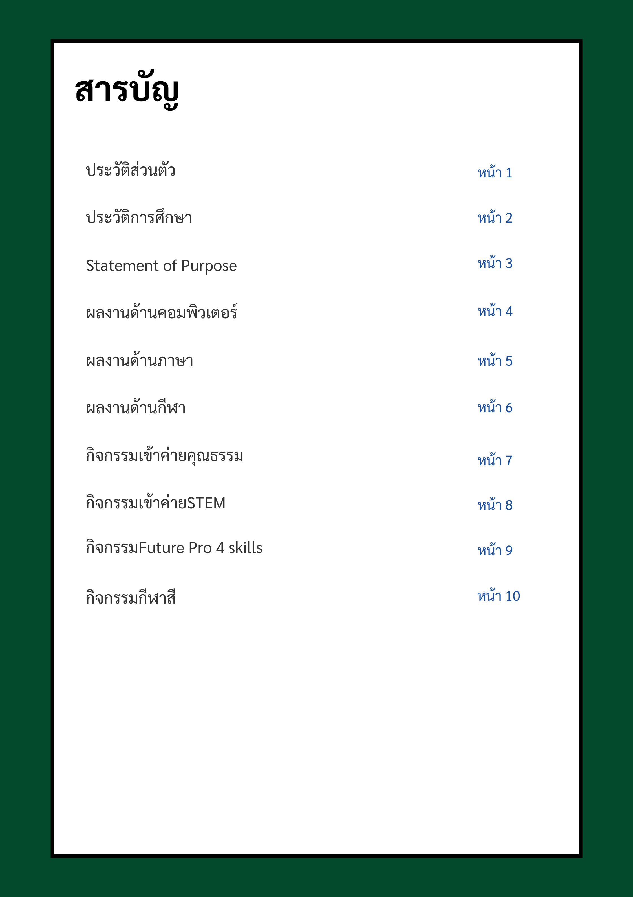
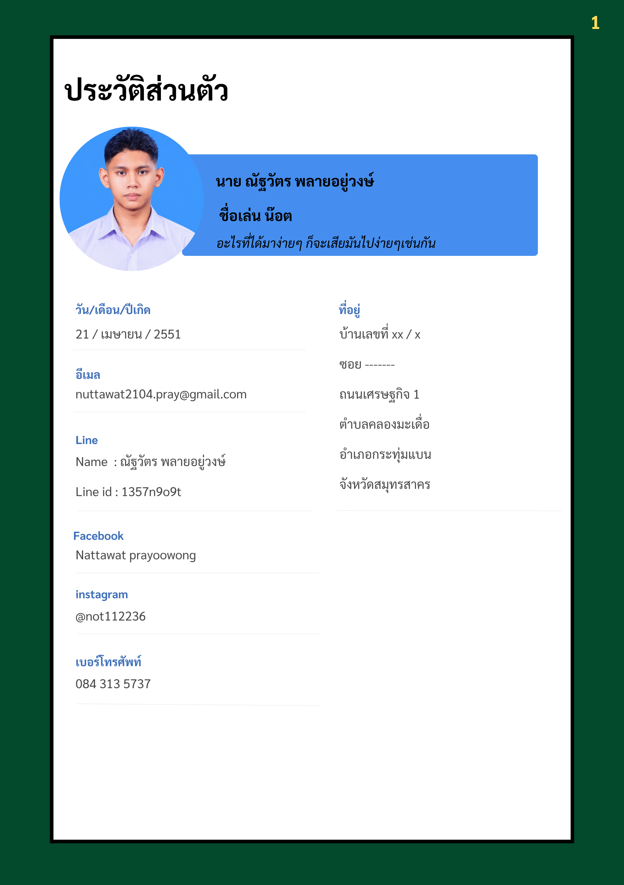
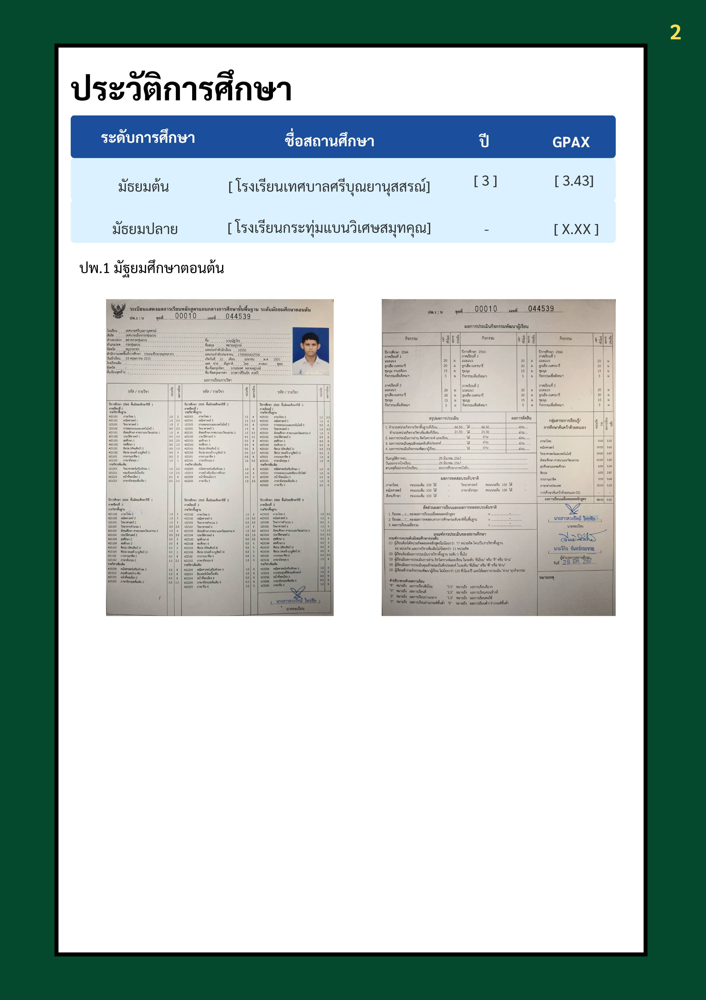
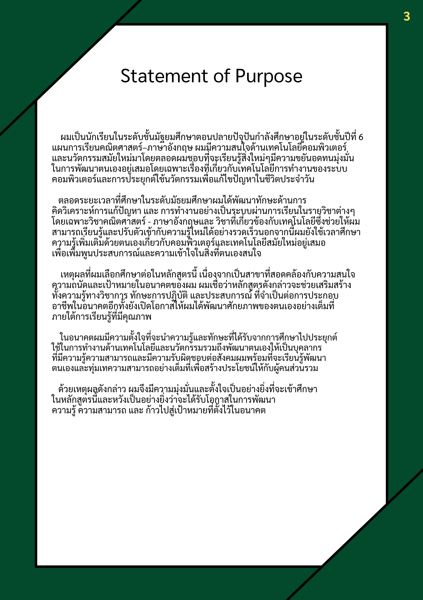
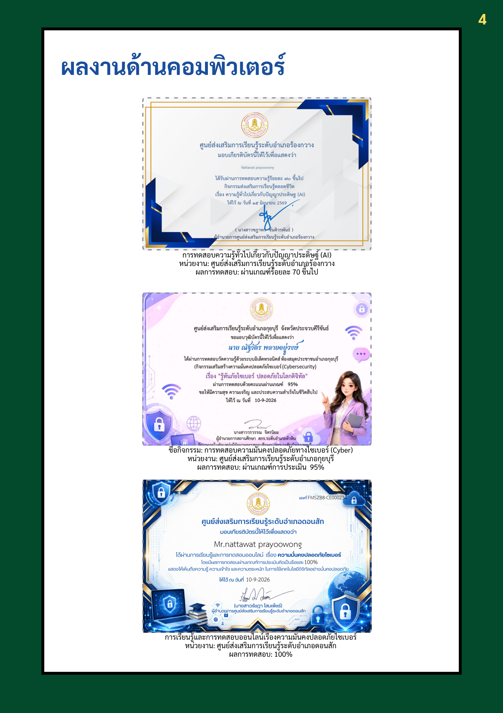
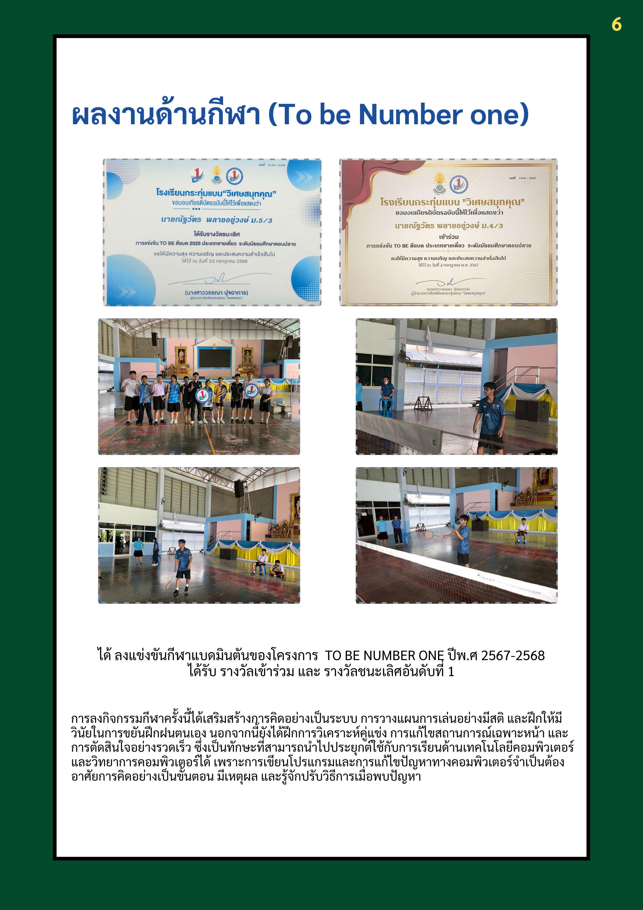
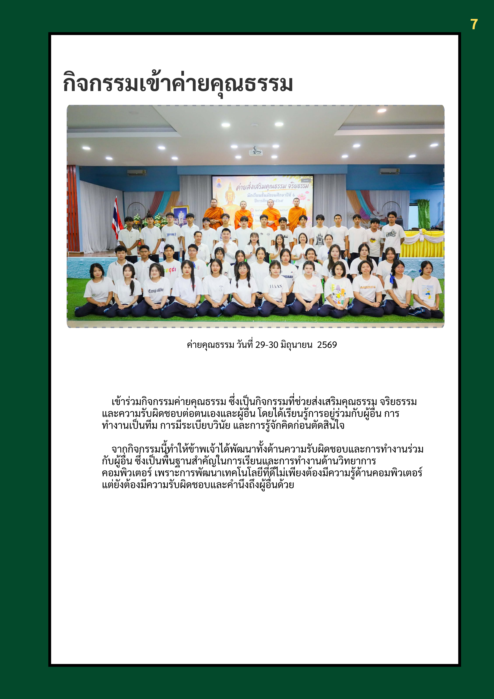
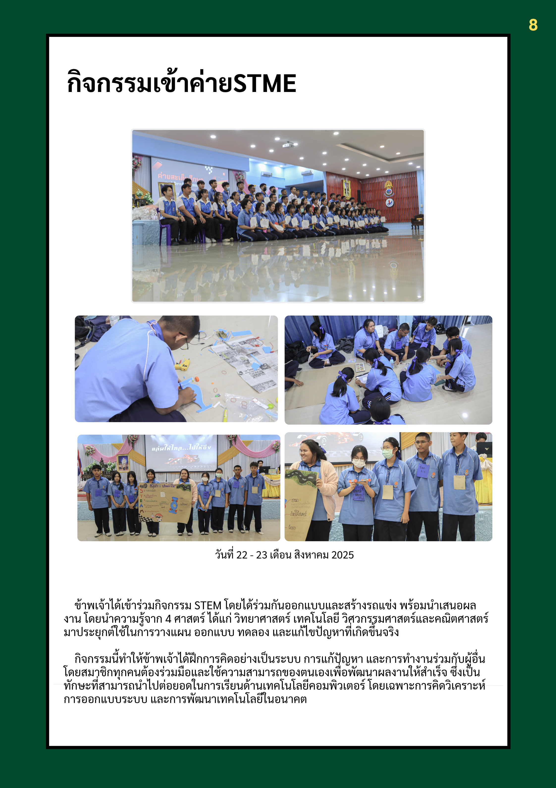
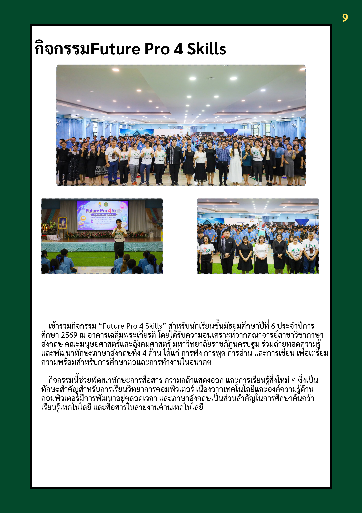
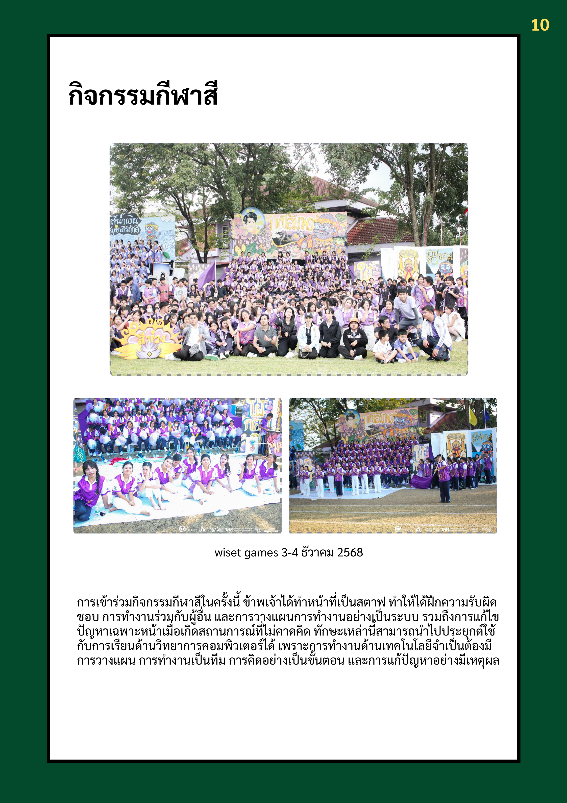

<!DOCTYPE html>
<html lang="th">
<head>
    <meta charset="UTF-8">
    <meta name="viewport" content="width=device-width, initial-scale=1.0">

    <title>My Portfolio</title>

    
</head>

<body>

    <main class="portfolio-container">

        <section class="portfolio-page">
            
        </section>

        <section class="portfolio-page">
            
        </section>

        <section class="portfolio-page">
            
        </section>

        <section class="portfolio-page">
            
        </section>

        <section class="portfolio-page">
            
        </section>

        <section class="portfolio-page">
            
        </section>

        <section class="portfolio-page">
            
        </section>

        <section class="portfolio-page">
            
        </section>

        <section class="portfolio-page">
            
        </section>

        <section class="portfolio-page">
            
        </section>

        <section class="portfolio-page">
            
        </section>

        <section class="portfolio-page">
            
        </section>

        <section class="portfolio-page">
            
        </section>

    </main>

</body>
</html>
